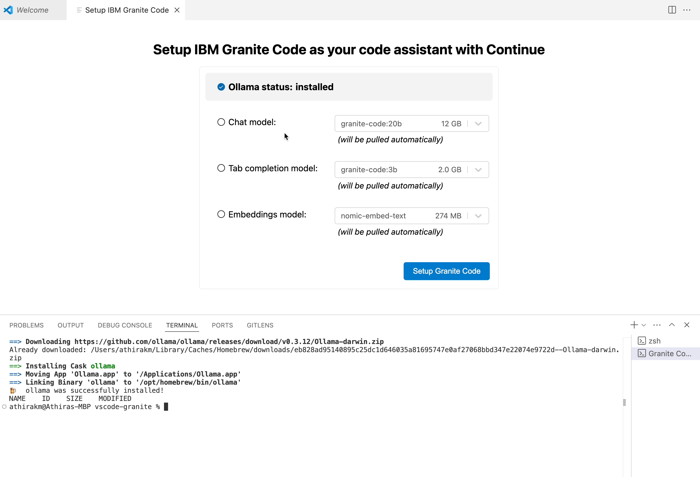
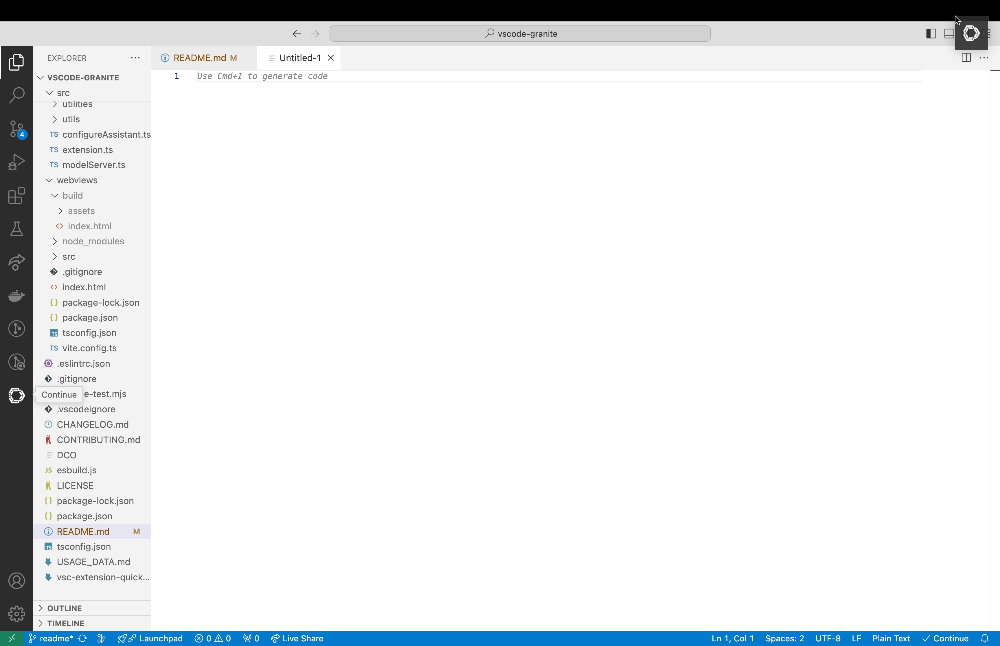

<!-- ABOUT THE PROJECT -->
## About The Project
In this project,we are building local AI co-pilot using **Granite Code, Ollama, and Continue**,where we utilize a collection of open-source components to implement a feature-rich developer co-pilot in Visual Studio Code, all while ensuring data privacy and compliance with licensing requirements. We are integrating Ollama with Continue to seamlessly work with Visual Studio Code. This integration will assist developers by accelerating the development process, enhancing performance, and improving code quality efficiently.

  

## vscode-granite

This extension allows you to easily setup the [Continue extension](https://marketplace.visualstudio.com/items?itemName=Continue.continue) to use [IBM](https://www.ibm.com/)'s [Granite code models](https://github.com/ibm-granite/granite-code-models), as your code assistant in VS Code.

### **Reasons to Choose Ollama**

- **Data Privacy:** Many corporations have privacy regulations that prohibit sending internal code or data to third-party services.
- **Generated Material Licensing:** Many models, even those with permissive usage licenses, do not disclose their training data and therefore may produce output that is derived from training material with licensing restrictions.
- **Cost:** Many of these tools are paid solutions that require investment by the organization. For larger organizations, this would often include paid support and maintenance contracts, which can be extremely costly and slow to negotiate.

### Models and Workflow of Vscode-Granite

vscode-granite uses the Granite Code model, which is optimized for enterprise software development workflows and performs well across a range of coding tasks (e.g., code generation, fixing, and explanation), making it a versatile "all-around" code model.

Granite Code comes in a wide range of sizes to fit your workstation's available resources. Generally, the bigger the model, the better the results.

**Recommendation:** Model Size 20B for chat, 8B for tab code completion.

For more details, refer to [Granite Code Models](https://github.com/ibm-granite/granite-code-models)

 ### Workflow of Vscode-Granite

 

 

 
### Installation Prerequisites:

  * OS: MacOS 
  * DISK SPACE :Minimum 30 GB 
  * latest [Visual Studio Code](https://code.visualstudio.com/)
  * [Node.js](https://nodejs.org/) v20.0.0 or higher
  * optional: [gh](https://cli.github.com/) to manage pull requests.
  * Install [continu.dev](https://marketplace.visualstudio.com/items?itemName=Continue.continue) extention on Visual studio code

### Steps run the extension
  * clone this repository

  <body>
    <h4>How to install vs-granite on macOS/Linux</h4>
    
Follow these steps to install <code>vs-granite</code> on your Mac/Linux machine :

    <ol>
        <li>Clone the repository:</li>
        <pre><code>git clone https://github.com/redhat-developer/vscode-granite.git </code></pre>
        <li>Navigate to the project directory:</li>
        <pre><code>cd vscode-granite</code></pre>
        <li>Install the NPM dependencies:</li>
        <pre><code>npm run install:ci</code></pre>
    </ol>
</body>

This will install the dependencies for the extension and its [webview(s)](https://code.visualstudio.com/api/extension-guides/webview)

#### Use Vscode-granite UI to install extention and models

This project offers an intuitive and streamlined UI designed to simplify the installation and management of extensions and Granite models. This user-friendly interface enables developers to quickly set up and configure their environment without needing to dive into complex configurations or terminal commands

 step 1: **Run the Extenstion**

Open VSCode and navigate to the Debugging tab on the left sidebar. Click on "Run and Debug," then select "Run Extension" to launch the extension.

 
 step 2:  **Install ollama**

Once the extension is running, a new window will prompt you to install Ollama. Simply click the "Install with home brew"(for mac users) button to initiate the installation process.

step 3: **Install granite models** 

 select the Granite model you wish to install. Follow the on-screen instruction to complete the setup of your models.

<h3 align="left">Why Continue.dev</h3>

[Continue](https://docs.continue.dev) is the leading open-source AI code assistant. You can connect any models and any context to build custom autocomplete and chat experiences inside [VS Code](https://marketplace.visualstudio.com/items?itemName=Continue.continue) and [JetBrains](https://plugins.jetbrains.com/plugin/22707-continue-extension)

* Easily understand code sections

* Tab to autocomplete code suggestions

* Refactor functions where you are coding

* Ask questions about your codebase

* Quickly use documentation as context

##### Use continue with VSCode 
For better experience move continue logo from left side bar to right
 

we can select  differnt model from the drop down model 

For more details, refer to [continue.dev](https://github.com/continuedev/continue)

## License
Apache 2.0, See [LICENSE](LICENSE) for more information.

## Telemetry

With your approval, the vscode-granite extension collects anonymous [usage data](USAGE_DATA.md) and sends it to Red Hat servers to help improve our products and services.
Read our [privacy statement](https://developers.redhat.com/article/tool-data-collection) to learn more.
This extension respects the `redhat.telemetry.enabled` setting, which you can learn more about at https://github.com/redhat-developer/vscode-redhat-telemetry#how-to-disable-telemetry-reporting
